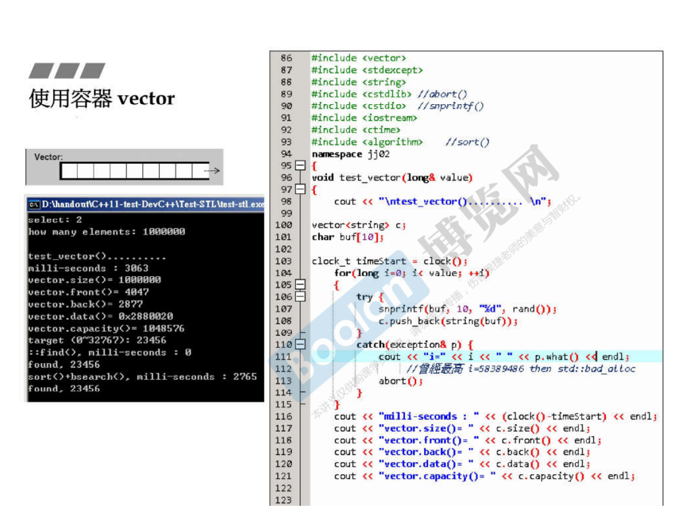
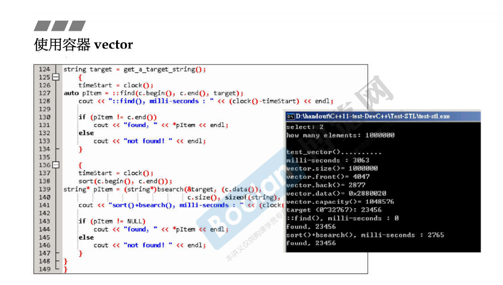

# 容器之分类与各种测试（三）

## 测试Vector




```cpp
#include <iostream>
#include <string>

using std::cin;
using std::cout;
using std::string;

long get_a_target_long() {
    long target = 0;

    cout << "target (0~" << RAND_MAX << "): ";
    cin >> target;
    return target;
}

string get_a_target_string() {
    long target = 0;
    char buf[10];

    cout << "target (0~" << RAND_MAX << "): ";
    cin >> target;
    snprintf(buf, 10, "%d", target);
    return string(buf);
}

int compareLongs(const void* a, const void* b) {
    return (*(long*)a - *(long*)b);
}

int compareStrings(const void* a, const void* b) {
    if (*(string*)a > *(string*)b)
        return 1;
    else if (*(string*)a < *(string*)b)
        return -1;
    else
        return 0;
}

#include <algorithm>  //sort()
#include <cstdio>     //snprintf()
#include <cstdlib>    //abort()
#include <ctime>
#include <iostream>
#include <stdexcept>
#include <string>
#include <vector>

using namespace std;

namespace jj02 {
void test_vector(long& value) {
    cout << "\ntest_vector().......... \n";

    vector<string> c;
    char buf[10];

    clock_t timeStart = clock();
    for (long i = 0; i < value; ++i) {
        try {
            snprintf(buf, 10, "%d", rand());
            c.push_back(string(buf));
        } catch (exception& p) {
            cout << "i=" << i << " " << p.what() << endl;
            // 曾經最高 i=58389486 then std::bad_alloc
            abort();
        }
    }
    cout << "milli-seconds : " << (clock() - timeStart) << endl;
    cout << "vector.max_size()= " << c.max_size() << endl;  // 1073747823
    cout << "vector.size()= " << c.size() << endl;
    cout << "vector.front()= " << c.front() << endl;
    cout << "vector.back()= " << c.back() << endl;
    cout << "vector.data()= " << c.data() << endl;
    cout << "vector.capacity()= " << c.capacity() << endl << endl;

    string target = get_a_target_string();
    {
        timeStart = clock();
        auto pItem = ::find(c.begin(), c.end(), target);
        cout << "std::find(), milli-seconds : " << (clock() - timeStart)
             << endl;

        if (pItem != c.end())
            cout << "found, " << *pItem << endl << endl;
        else
            cout << "not found! " << endl << endl;
    }

    {
        timeStart = clock();
        sort(c.begin(), c.end());
        cout << "sort(), milli-seconds : " << (clock() - timeStart) << endl;

        timeStart = clock();
        string* pItem = (string*)::bsearch(&target, (c.data()), c.size(),
                                           sizeof(string), compareStrings);
        cout << "bsearch(), milli-seconds : " << (clock() - timeStart) << endl;

        if (pItem != NULL)
            cout << "found, " << *pItem << endl << endl;
        else
            cout << "not found! " << endl << endl;
    }

    c.clear();
    // test_moveable(vector<MyString>(), vector<MyStrNoMove>(), value);
}
}  // namespace jj02

int main(int argc, char** argv) {
    long value;
    cin >> value;
    jj02::test_vector(value);

    return 0;
}
```
g++ 测试结果
```cpp
$ ./main
1000000

test_vector().......... 
milli-seconds : 194354
vector.max_size()= 288230376151711743
vector.size()= 1000000
vector.front()= 180428938
vector.back()= 429357853
vector.data()= 0x7fbd00b00010
vector.capacity()= 1048576

target (0~2147483647): 180428938
std::find(), milli-seconds : 13
found, 180428938

sort(), milli-seconds : 503263
bsearch(), milli-seconds : 8
found, 180428938

```

msvc x86 测试结果
```cpp
1000000

test_vector()..........
milli-seconds : 5348
vector.max_size()= 153391689
vector.size()= 1000000
vector.front()= 41
vector.back()= 12679
vector.data()= 09DF7060
vector.capacity()= 1049869

target (0~32767): 23456
std::find(), milli-seconds : 5
found, 23456

sort(), milli-seconds : 9462
bsearch(), milli-seconds : 0
found, 23456
```

msvc x64 测试结果
```cpp
1000000

test_vector()..........
milli-seconds : 2560
vector.max_size()= 461168601842738790
vector.size()= 1000000
vector.front()= 41
vector.back()= 12679
vector.data()= 0000023CE1978080
vector.capacity()= 1049869

target (0~32767): 23456
std::find(), milli-seconds : 2
found, 23456

sort(), milli-seconds : 3451
bsearch(), milli-seconds : 0
found, 23456
```

