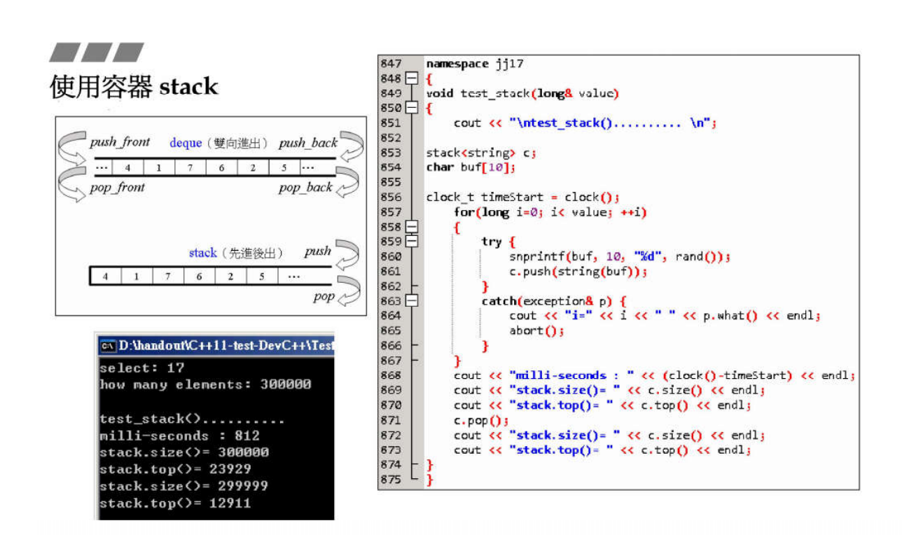

# 容器之分类与各种测试（三）

## 测试 list


```cpp
void test_list(long& value) {
    cout << "\ntest_list().......... \n";

    list<string> c;
    char buf[10];

    clock_t timeStart = clock();
    for (long i = 0; i < value; ++i) {
        try {
            snprintf(buf, 10, "%d", rand());
            c.push_back(string(buf));
        } catch (exception& p) {
            cout << "i=" << i << " " << p.what() << endl;
            abort();
        }
    }
    cout << "milli-seconds : " << (clock() - timeStart) << endl;
    cout << "list.size()= " << c.size() << endl;
    cout << "list.max_size()= " << c.max_size() << endl;  // 357913941
    cout << "list.front()= " << c.front() << endl;
    cout << "list.back()= " << c.back() << endl;

    string target = get_a_target_string();
    timeStart = clock();
    auto pItem = find(c.begin(), c.end(), target);
    cout << "std::find(), milli-seconds : " << (clock() - timeStart) << endl;

    if (pItem != c.end())
        cout << "found, " << *pItem << endl;
    else
        cout << "not found! " << endl;

    timeStart = clock();
    c.sort();
    cout << "c.sort(), milli-seconds : " << (clock() - timeStart) << endl;

    c.clear();
    // test_moveable(list<MyString>(), list<MyStrNoMove>(), value);
}
```

g++ 测试结果
```cpp
$ ./main
1000000

test_list().......... 
milli-seconds : 247703
list.size()= 1000000
list.max_size()= 192153584101141162
list.front()= 180428938
list.back()= 429357853
target (0~2147483647): 429357853
std::find(), milli-seconds : 26840
found, 429357853
c.sort(), milli-seconds : 1004464
```

msvc测试结果
```cpp
1000000

test_list()..........
milli-seconds : 3113
list.size()= 1000000
list.max_size()= 119304647
list.front()= 41
list.back()= 12679
target (0~32767): 23456
std::find(), milli-seconds : 8
found, 23456
c.sort(), milli-seconds : 5098
```

## 测试 forward_list


```cpp
void test_forward_list(long& value) {
    cout << "\ntest_forward_list().......... \n";

    forward_list<string> c;
    char buf[10];

    clock_t timeStart = clock();
    for (long i = 0; i < value; ++i) {
        try {
            snprintf(buf, 10, "%d", rand());
            c.push_front(string(buf));
        } catch (exception& p) {
            cout << "i=" << i << " " << p.what() << endl;
            abort();
        }
    }
    cout << "milli-seconds : " << (clock() - timeStart) << endl;
    cout << "forward_list.max_size()= " << c.max_size() << endl;  // 536870911
    cout << "forward_list.front()= " << c.front() << endl;

    string target = get_a_target_string();
    timeStart = clock();
    auto pItem = find(c.begin(), c.end(), target);
    cout << "std::find(), milli-seconds : " << (clock() - timeStart) << endl;

    if (pItem != c.end())
        cout << "found, " << *pItem << endl;
    else
        cout << "not found! " << endl;

    timeStart = clock();
    c.sort();
    cout << "c.sort(), milli-seconds : " << (clock() - timeStart) << endl;

    c.clear();
}
```

msvc x86 测试结果
```cpp
1000000

test_forward_list()..........
milli-seconds : 2905
forward_list.max_size()= 134217727
forward_list.front()= 12679
target (0~32767): 23456
std::find(), milli-seconds : 8
found, 23456
c.sort(), milli-seconds : 5312
```

## 测试 deque


```cpp
void test_deque(long& value) {
    cout << "\ntest_deque().......... \n";

    deque<string> c;
    char buf[10];

    clock_t timeStart = clock();
    for (long i = 0; i < value; ++i) {
        try {
            snprintf(buf, 10, "%d", rand());
            c.push_back(string(buf));
        } catch (exception& p) {
            cout << "i=" << i << " " << p.what() << endl;
            abort();
        }
    }
    cout << "milli-seconds : " << (clock() - timeStart) << endl;
    cout << "deque.size()= " << c.size() << endl;
    cout << "deque.front()= " << c.front() << endl;
    cout << "deque.back()= " << c.back() << endl;
    cout << "deque.max_size()= " << c.max_size() << endl;  // 1073741821

    string target = get_a_target_string();
    timeStart = clock();
    auto pItem = find(c.begin(), c.end(), target);
    cout << "std::find(), milli-seconds : " << (clock() - timeStart) << endl;

    if (pItem != c.end())
        cout << "found, " << *pItem << endl;
    else
        cout << "not found! " << endl;

    timeStart = clock();
    sort(c.begin(), c.end());
    cout << "sort(), milli-seconds : " << (clock() - timeStart) << endl;

    c.clear();
    // test_moveable(deque<MyString>(),deque<MyStrNoMove>(), value);
}
```
msvc x86 测试deque结果
```cpp
1000000

test_deque()..........
milli-seconds : 3282
deque.size()= 1000000
deque.front()= 41
deque.back()= 12679
deque.max_size()= 153391689
target (0~32767): 23456
std::find(), milli-seconds : 8
found, 23456
sort(), milli-seconds : 13377
```

msvc x64 测试deque结果
```cpp
1000000

test_deque()..........
milli-seconds : 1509
deque.size()= 1000000
deque.front()= 41
deque.back()= 12679
deque.max_size()= 461168601842738790
target (0~32767): 23456
std::find(), milli-seconds : 3
found, 23456
sort(), milli-seconds : 5138
```

## 测试 stack




```cpp
void test_stack(long& value) {
    cout << "\ntest_stack().......... \n";

    stack<string> c;
    char buf[10];

    clock_t timeStart = clock();
    for (long i = 0; i < value; ++i) {
        try {
            snprintf(buf, 10, "%d", rand());
            c.push(string(buf));
        } catch (exception& p) {
            cout << "i=" << i << " " << p.what() << endl;
            abort();
        }
    }
    cout << "milli-seconds : " << (clock() - timeStart) << endl;
    cout << "stack.size()= " << c.size() << endl;
    cout << "stack.top()= " << c.top() << endl;
    c.pop();
    cout << "stack.size()= " << c.size() << endl;
    cout << "stack.top()= " << c.top() << endl;
}
```

msvc x86 测试stack结果
```cpp
1000000

test_stack()..........
milli-seconds : 3308
stack.size()= 1000000
stack.top()= 12679
stack.size()= 999999
stack.top()= 17172
```

## 测试 queue


```cpp
void test_queue(long& value) {
    cout << "\ntest_queue().......... \n";

    queue<string> c;
    char buf[10];

    clock_t timeStart = clock();
    for (long i = 0; i < value; ++i) {
        try {
            snprintf(buf, 10, "%d", rand());
            c.push(string(buf));
        } catch (exception& p) {
            cout << "i=" << i << " " << p.what() << endl;
            abort();
        }
    }
    cout << "milli-seconds : " << (clock() - timeStart) << endl;
    cout << "queue.size()= " << c.size() << endl;
    cout << "queue.front()= " << c.front() << endl;
    cout << "queue.back()= " << c.back() << endl;
    c.pop();
    cout << "queue.size()= " << c.size() << endl;
    cout << "queue.front()= " << c.front() << endl;
    cout << "queue.back()= " << c.back() << endl;
}
```
msvc x86 测试结果
```cpp
1000000

test_queue()..........
milli-seconds : 3319
queue.size()= 1000000
queue.front()= 41
queue.back()= 12679
queue.size()= 999999
queue.front()= 18467
queue.back()= 12679
```