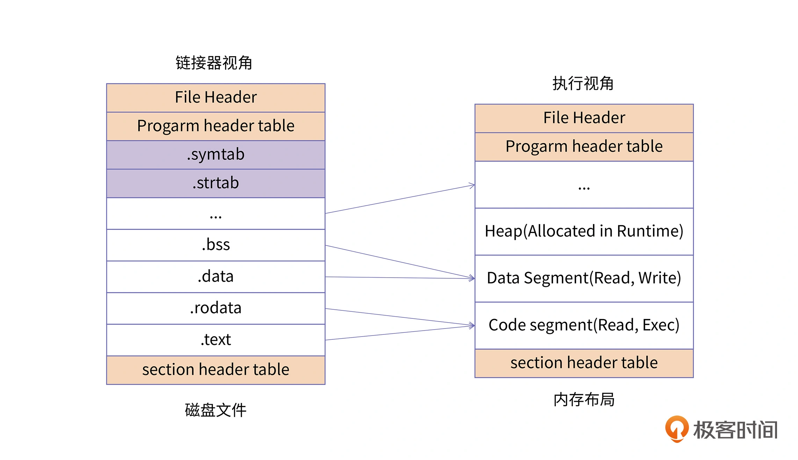
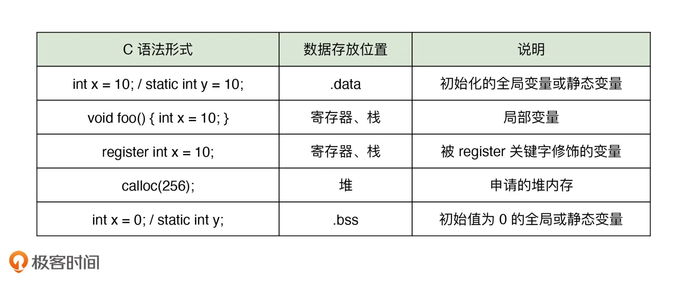
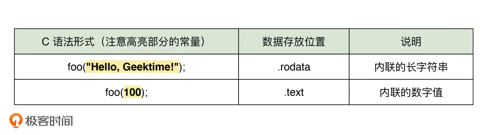

# 进程虚拟地址空间区域划分 

## 参考链接
- [深入 C 语言和程序运行原理](https://time.geekbang.org/column/intro/100100701)
- [编程高手必学的内存知识](https://time.geekbang.org/column/intro/100094901)
- [【中级】C++开发工程师基础进阶课程-夯实C++基础核心内容](https://ke.qq.com/course/464039#term_id=103626440)