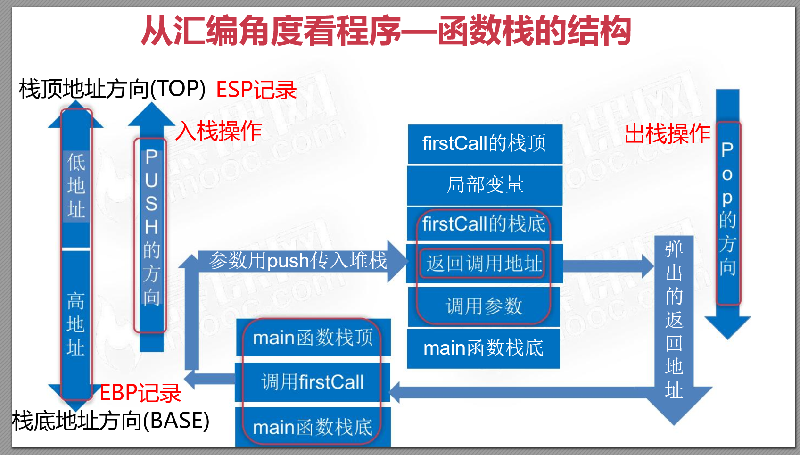

# 从指令角度掌握函数调用堆栈  



## 例子
```cpp
#include <iostream>
using namespace std;

int f(int n) {
    cout << n << endl;
    return n;
}

void func(int param1, int param2) {
    int var1 = param1;
    int var2 = param2;
    // 先输出2再输出1；如果将printf换为cout进行输出，输出结果则刚好相反。
    printf("var1 = %d,var2 = %d \n", f(var1), f(var2));

    cout << "分隔线------------------------------" << endl;

    // 先输出1再输出2
    cout << f(var1) << " " << f(var2) << endl;
}

int main(int argc, char* argv[]) {
    func(1, 2);
    return 0;
}
// 输出结果
// 2
// 1
// var1 = 1,var2 = 2 
// 分隔线------------------------------
// 1
// 1 2
// 2
```

当函数从入口函数main函数开始执行时，编译器会将我们操作系统的运行状态，```main```函数的返回地址、```main```的参数、```main```函数中的变量、进行依次压栈；    

当main函数开始调用```func()```函数时，编译器此时会将```main```函数的运行状态进行压栈，再将```func()```函数的返回地址、```func()```函数的参数从右到左、```func()```定义变量依次压栈；    

当```func()```调用```f()```的时候，编译器此时会将```func()```函数的运行状态进行压栈，再将的返回地址、```f()```函数的参数从右到左、```f()```定义变量依次压栈；    
 
从代码的输出结果可以看出，函数```f(var1)```、```f(var2)```依次入栈，而后先执行```f(var2)```，再执行```f(var1)```，最后打印整个字符串，将栈中的变量依次弹出，最后主函数返回。 (只考虑```printf```情况)

```
函数的调用过程：

1）从栈空间分配存储空间

2）从实参的存储空间复制值到形参栈空间

3）进行运算

形参在函数未调用之前都是没有分配存储空间的，在函数调用结束之后，形参弹出栈空间，清除形参空间。

数组作为参数的函数调用方式是地址传递，形参和实参都指向相同的内存空间，调用完成后，形参指针被销毁，但是所指向的内存空间依然存在，不能也不会被销毁。

当函数有多个返回值的时候，不能用普通的 return 的方式实现，需要通过传回地址的形式进行，即地址/指针传递
```
## 参考链接
- [深入 C 语言和程序运行原理](https://time.geekbang.org/column/intro/100100701)
- [编程高手必学的内存知识](https://time.geekbang.org/column/intro/100094901)
- [【中级】C++开发工程师基础进阶课程-夯实C++基础核心内容](https://ke.qq.com/course/464039#term_id=103626440)
- [2020 重学C++重构你的C++知识体系](https://coding.imooc.com/learn/list/414.html)