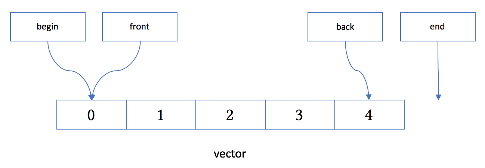

## ```vector```
```cpp
vector：向量容器
底层数据结构：动态开辟的数组，每次以原来空间大小的2倍进行扩容的

vector<int> vec;
增加:
vec.push_back(20); 末尾添加元素 O(1)   导致容器扩容
vec.insert(it, 20); it迭代器指向的位置添加一个元素20  O(n)   导致容器扩容

删除:
vec.pop_back(); 末尾删除元素 O(1)
vec.erase(it); 删除it迭代器指向的元素 O(n)

查询:
operator[] 下标的随机访问vec[5]  O(1)
iterator迭代器进行遍历
find，for_each
foreach => 通过iterator来实现的

注意：对容器进行连续插入或者删除操作(insert/erase)，一定要更新迭代器，否则第一次insert或者erase完成，
迭代器就失效了

常用方法介绍:
size()
empty()
reserve(20)：vector预留空间的
只给容器底层开辟指定大小的内存空间，并不会添加新的元素 
resize(20)：容器扩容用的
不仅给容器底层开辟指定大小的内存空间，还会添加新的元素 
swap() ：
两个容器进行元素交换
```
