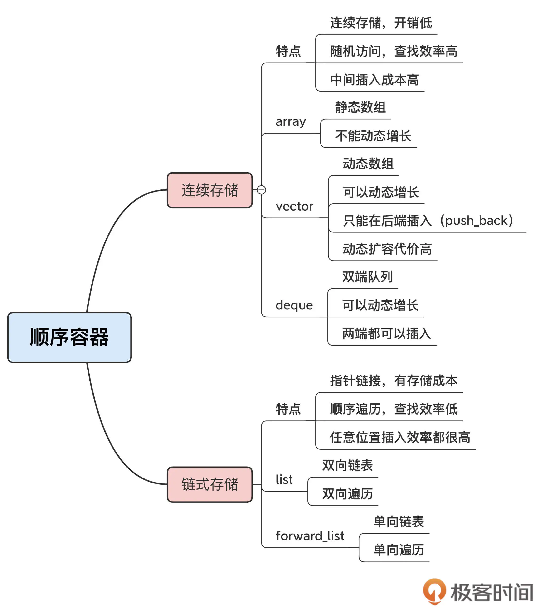

## ```vector```, ```deque``` 和 ```list```对比
```cpp
#include <vector>
#include <deque>
#include <list>
```
```cpp
vector特点：动态数组，内存是连续的，2倍的方式进行扩容， vector<int> vec; 0-1-2-4-8... reserve(20)/resize
deque特点：动态开辟的二维数组空间，第二维是固定长度的数组空间，扩容的时候（第一维的数组进行2倍扩容）
	面经问题：deque底层内存是否是连续的？   并不是  每一个第二维是连续的。（分段连续）

容器的纵向考察：容器掌握的深度
容器的横向考察：各个相似容器之间的对比

vector和deque之间的区别？
1.底层数据结构：
2.前中后插入删除元素的时间复杂度： 末尾都是 O(1); 前 deque O(1), vector O(n); 中间都是O(n)
3.对于内存的使用效率： vector 需要的内存空间必须是连续的    deque 可以分块进行数据存储，不需要内存空间必须是一片连续的
4.在中间进行insert或者erase，vector和deque它们的效率谁能好一点(vector)？谁能差一点(deque)？  O(n)
```
> ```deque``` 的第二维内存空间不是连续的，所以在 ```deque``` 中间进行元素的 ```insert``` 或者 ```erase``` ，造成元素移动的时候比 ```vector``` 要慢
```cpp
for(int i=0; i<10000; ++i)
{
	cout << arr[i] << endl;
}

vector和list之间的区别？   
数组:增加删除O(n) 查询O(n) 随机访问O(1)   链表:(考虑搜索的时间)增加删除O(1)  查询O(n)
底层数据结构：数组   双向循环链表
```

