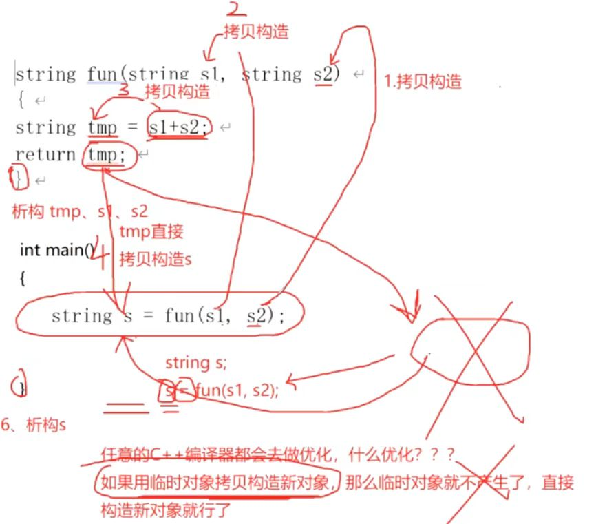
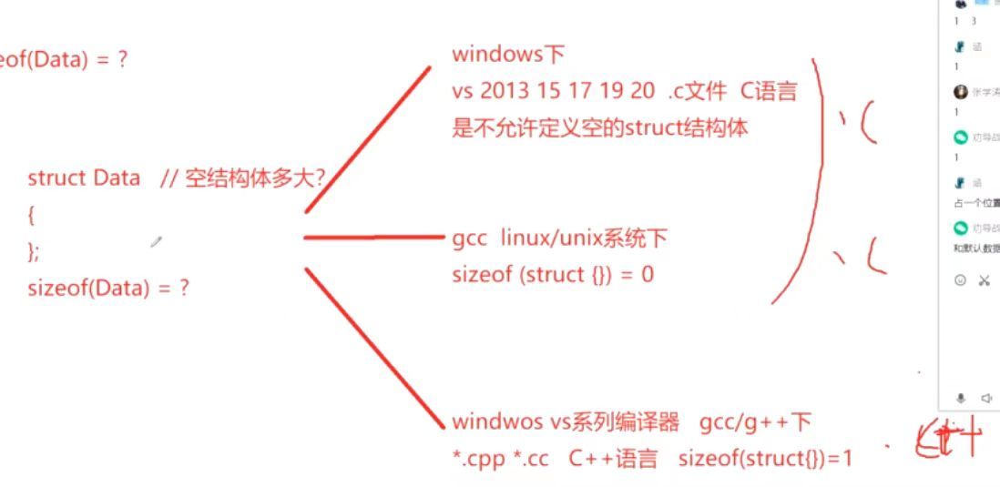

# 面经题目

## 商汤 C++（机器学习） 二面面经

1. 程序的内存布局

2. 堆和栈的区别

3. 函数调用参数怎么传递的？

4. 函数的参数按照什么顺序压栈？  
    默认按照从右往左。

5. 为什么函数调用的参数要从右往左压栈？
- [c/c++参数入栈顺序和参数计算顺序](https://mp.weixin.qq.com/s/U4i32KMzmisQ2u6MqSkmiQ)
- [知乎专栏](https://zhuanlan.zhihu.com/p/381907110)
每个参数都有自己的地址，但不定长参数无法确认地址，并且函数参数的个数也不确定，C/C++中规定了函数参数的压栈顺序是从右至左，对于含有不定参数的printf函数，其原型是printf（const char* format,…）；其中format确定了printf的参数（通过format的%个数判断）。  
假设是从左至右压栈，那么先入栈的是format，然后依次入栈未知参数，此时想要知道参数个数，就必须找到format，而要找到format，就必须知道参数个数，这样就会陷入一个死胡同里面了。
对于不定参数，最后入栈的是参数个数，只需要取栈顶就可以得到。（ebp + 4）

6.  ```cpp
    string func(string s1, string s2) {
        string tmp = s1 + s2;
        return tmp;
    }
    int main() {
        ...
        string s = func(s1, s2);
        return 0;
    }
    ```
    - 分析构造函数、析构函数顺序。   
    如果用临时对象拷贝构造新对象（任何C++编译器都会做这样的优化），那么临时对象就不产生了，直接构造新对象。    
    本题过程：函数压栈从右往左压栈，因为形参不是传指针和引用，是按值传递，实参s2拷贝构造s2，实参s1拷贝构造s1，s1 + s2 拷贝构造tmp, tmp拷贝构造s（并没有产生临时对象），出了func函数括号依次析构tmp、s1、s2，出了main函数括号析构s。
    
    -  如果func函数内写成 ```return s1 + s2```。    
    省略了tmp的构造和析构函数调用。
7. 一个结构体里面定义里面定义了一个 char 和 double , 它的空间布局是怎么样的？空结构体呢？
    ```cpp
    #include <iostream>

    using namespace std;

    struct Data1 {
        char c;
        double t;
    };
    struct Data2 {
        char c;
    };
    struct Data3 {};
    struct Data4 {
        virtual void func() {}
    };
    struct Data5 : public virtual Data3 {};
    struct Data6 : public virtual Data4 {};

    int main() {
        cout << sizeof(Data1) << endl;
        cout << sizeof(Data2) << endl;
        cout << sizeof(Data3) << endl;
        cout << sizeof(Data4) << endl;
        cout << sizeof(Data5) << endl;
        cout << sizeof(Data6) << endl;

        return 0;
    }
    // msvc x64下运行结果
    16
    1
    1
    8
    8
    16

    // msvc x86下运行结果
    16
    1
    1
    4
    4
    8

    // g++ clang++ 64位运行结果
    16
    1
    1
    8
    8
    8

    // clang++ -m32 test.cpp -o test
    // g++ -m32 test.cpp -o test
    12
    1
    1
    4
    4
    4
    ```
    Data 是16， Data2是1，Data3是1（C++中是1）  
    C++的struct是默认是public访问的类。  
    任何不同的对象不能拥有相同的内存地址。如果空类对象大小为0，那么此类数组中的各个对象的地址将会一致，明显违反了此原则。  
    类在实例化的过程中，都会获得一个独一无二的内存地址，为了达到这个目的，编译器往往会给空类隐含的增加一个字节（char），这样空类在实例化后的内存中得到了独一无二的地址。
    

8. 手撕代码——[leetcode772](https://leetcode.cn/problems/basic-calculator-iii/)
