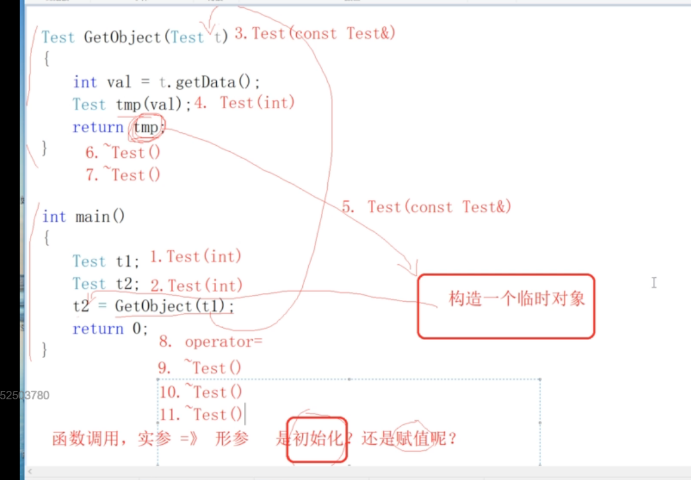
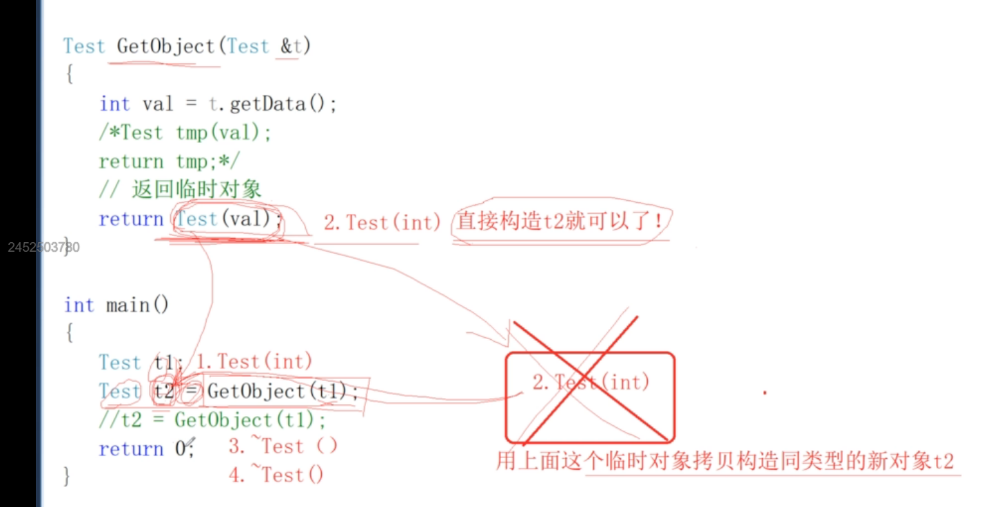

## 对象优化
#### 未优化代码
```cpp
class Test {
   public:
    // Test()  Test(20)
    Test(int data = 10) : ma(data) { cout << "Test(int)" << endl; }
    ~Test() { cout << "~Test()" << endl; }
    Test(const Test& t) : ma(t.ma) { cout << "Test(const Test&)" << endl; }
    void operator=(const Test& t) {
        cout << "operator=" << endl;
        ma = t.ma;
    }
    int getData() const { return ma; }

   private:
    int ma;
};

Test GetObject(Test t) {
    int val = t.getData();
    Test tmp(val);
    return tmp;
}
int main() {
    Test t1;
    Test t2;
    t2 = GetObject(t1);
    return 0;
}
```
```cpp
// msvc 2019 运行结果
Test(int)
Test(int)
Test(const Test&)
Test(int)
Test(const Test&)
~Test()
~Test()
operator=
~Test()
~Test()
~Test()

// msvc 2022 运行结果, 做了优化
Test(int)
Test(int)
Test(const Test&)
Test(int)
~Test()
operator=
~Test()
~Test()
~Test()
```



1. ```Test(int)``` 调用整型参数构造函数构造t1
2. ```Test(int)``` 调用整型参数构造函数构造t2
3. ```Test(const Test &)``` t1拷贝构造形参t
4. ```Test(int)``` 调用整型参数构造函数构造tmp
5. ```Test(const Test&)``` tmp拷贝构造临时对象（临时对象在main函数栈帧上）
6. ```~Test()``` tmp析构
7. ```~Test()``` 形参t析构
8. ```operator=``` 临时对象给t2赋值
9. ```~Test()``` 临时对象析构
10. ```~Test()``` t2析构
11. ```~Test()``` t1析构

> 函数调用，实参到形参，是初始化，不是赋值

```
1. 函数参数传递过程中，对象优先按引用传递，不要按值传递
2. 函数返回对象的时候，应该优先返回一个临时对象，而不要返回一个定义过的对象
3. 接收返回值是对象的函数调用的时候，优先按初始化的方式接收，不要按赋值的方式接收
```
#### 优化代码
```cpp
#include <iostream>

using std::cout;
using std::endl;

class Test {
   public:
    // Test()  Test(20)
    Test(int data = 10) : ma(data) { cout << "Test(int)" << endl; }
    ~Test() { cout << "~Test()" << endl; }
    Test(const Test& t) : ma(t.ma) { cout << "Test(const Test&)" << endl; }
    void operator=(const Test& t) {
        cout << "operator=" << endl;
        ma = t.ma;
    }
    int getData() const { return ma; }

   private:
    int ma;
};
// 不能返回局部的或者临时对象的指针或引用
/*
1. 函数参数传递过程中，对象优先按引用传递，不要按值传递
2. 函数返回对象的时候，应该优先返回一个临时对象，而不要返回一个定义过的对象
3. 接收返回值是对象的函数调用的时候，优先按初始化的方式接收，不要按赋值的方式接收
*/
Test GetObject(Test& t) {
    int val = t.getData();
    /*Test tmp(val);
    return tmp;*/
    // 返回临时对象
    return Test(val);
}
int main() {
    Test t1;
    Test t2 = GetObject(t1);
    // t2 = GetObject(t1);
    return 0;
}
```
```cpp
// 运行结果
$ ./test
Test(int)
Test(int)
~Test()
~Test()
```
