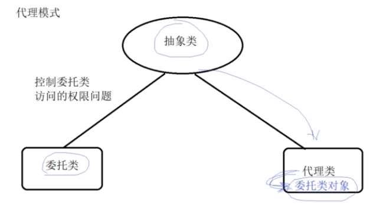

## 代理模式

```cpp
#include <iostream>
#include <memory>
using namespace std;

/*
代理Proxy模式 : 通过代理类，来控制实际对象的访问权限
客户     助理Proxy     老板 委托类
*/
class VideoSite  // #1 抽象类
{
   public:
    virtual void freeMovie() = 0;    // 免费电影
    virtual void vipMovie() = 0;     // vip电影
    virtual void ticketMovie() = 0;  // 用券观看电影
};

// 委托类 #2
class FixBugVideoSite : public VideoSite {
   public:
    virtual void freeMovie()  // 免费电影
    {
        cout << "观看免费电影" << endl;
    }
    virtual void vipMovie()  // vip电影
    {
        cout << "观看VIP电影" << endl;
    }
    virtual void ticketMovie()  // 用券观看电影
    {
        cout << "用券观看电影" << endl;
    }
};

// 代理类 #3 代理FixBugVideoSite
class FreeVideoSiteProxy : public VideoSite {
   public:
    virtual void freeMovie()  // 免费电影
    {
        // 通过代理对象的freeMovie，来访问真正委托类对象的freeMovie方法
        Video.freeMovie();
    }
    virtual void vipMovie()  // vip电影
    {
        cout << "您目前只是普通游客，需要升级成VIP，才能观看VIP电影" << endl;
    }
    virtual void ticketMovie()  // 用券观看电影
    {
        cout << "您目前没有券，需要购买电影券，才能观看电影" << endl;
    }

   private:
    FixBugVideoSite Video;  // # 4
};

// 代理类 代理FixBugVideoSite, 使用指针
class VipVideoSiteProxy : public VideoSite {
   public:
    VipVideoSiteProxy() { pVideo = new FixBugVideoSite(); }
    ~VipVideoSiteProxy() { delete pVideo; }
    virtual void freeMovie()  // 免费电影
    {
        // 通过代理对象的freeMovie，来访问真正委托类对象的freeMovie方法
        pVideo->freeMovie();
    }
    virtual void vipMovie()  // vip电影
    {
        pVideo->vipMovie();
    }
    virtual void ticketMovie()  // 用券观看电影
    {
        cout << "您目前没有券，需要购买电影券，才能观看电影" << endl;
    }

   private:
    VideoSite *pVideo;
};

// 这些都是通用的API接口，使用的都是基类的指针或者引用
void watchMovice(unique_ptr<VideoSite> &ptr) {
    ptr->freeMovie();
    ptr->vipMovie();
    ptr->ticketMovie();
}

int main() {
    // #5 客户直接访问代理对象
    unique_ptr<VideoSite> p1(new FreeVideoSiteProxy());
    unique_ptr<VideoSite> p2(new VipVideoSiteProxy());

    watchMovice(p1);
    watchMovice(p2);

    return 0;
}
```