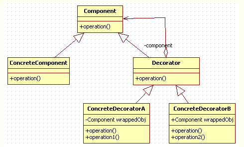

## 装饰器模式
装饰器模式（Decorator Pattern）允许向一个现有的对象添加新的功能，同时又不改变其结构。这种类型的设计模式属于结构型模式，它是作为现有的类的一个包装。



- Component 为统一接口，也是装饰类和被装饰类的基本类型。
- ConcreteComponent 为具体实现类，也是被装饰类，他本身是个具有一些功能的完整的类。
- Decorator 是装饰类，实现了 Component 接口的同时还在内部维护了一个 ConcreteComponent 的实例，并可以通过构造函数初始化。而 Decorator 本身，通常采用默认实现，他的存在仅仅是一个声明：我要生产出一些用于装饰的子类了。而其子类才是赋有具体装饰效果的装饰产品类。
- ConcreteDecorator 是具体的装饰产品类，每一种装饰产品都具有特定的装饰效果。可以通过构造器声明装饰哪种类型的 ConcreteComponent ，从而对其进行装饰。

```cpp
#include <iostream>
#include <memory>

using namespace std;

class Car {  // 抽象基类
   public:
    virtual void show() = 0;
};

class Bmw : public Car {
   public:
    void show() { cout << "这是一辆宝马汽车，配置有：基类配置"; }
};
class Audi : public Car {
   public:
    void show() { cout << "这是一辆奥迪汽车，配置有：基类配置"; }
};
class Benz : public Car {
   public:
    void show() { cout << "这是一辆奔驰汽车，配置有：基类配置"; }
};

// 装饰器的基类
class CarDecorator : public Car {
   public:
    CarDecorator(Car* p) : pCar(p) {}

   private:
    Car* pCar;
};

class ConcreteDecorator01 : public Car {
   public:
    ConcreteDecorator01(Car* p) : pCar(p) {}
    void show() {
        pCar->show();
        cout << ", 定速巡航";
    }

   private:
    Car* pCar;
};

class ConcreteDecorator02 : public Car {
   public:
    ConcreteDecorator02(Car* p) : pCar(p) {}
    void show() {
        pCar->show();
        cout << ", 自动刹车";
    }

   private:
    Car* pCar;
};

class ConcreteDecorator03 : public Car {
   public:
    ConcreteDecorator03(Car* p) : pCar(p) {}
    void show() {
        pCar->show();
        cout << ", 车道偏离";
    }

   private:
    Car* pCar;
};

int main() {
    Car* p1 = new ConcreteDecorator01(new Bmw());
    p1 = new ConcreteDecorator02(p1);
    p1 = new ConcreteDecorator03(p1);
    p1->show();
    cout << endl;

    Car* p2 = new ConcreteDecorator01(new Audi());
    p2->show();
    cout << endl;

    Car* p3 = new ConcreteDecorator01(new Benz());
    p3->show();
    cout << endl;

    return 0;
}
```