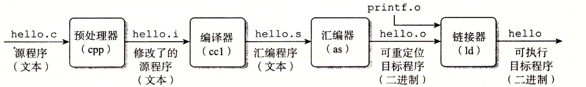

# 第一章 开始

## 编译与运行



上图是一个 C 程序（C++ 程序类似）的编译过程，可供参考。

**g++**：

- 编译：`g++ --std=c++11 ch01.cpp -o main`
- 运行：`./prog1`
- 查看运行状态：`echo $?`
- 编译多个文件:`g++ ch2.cpp Sales_item.cc -o main`

输入 `g++ --help`，可查看编译器选项

## 标准输入输出对象

标准库定义类4个 IO 对象。输入， 使用一个名为 `cin` 的 `istream`  类型的对象。 输出，使用一个名为 `cout` 的 `ostream` 类型的对象。标准库还定义了其他两个 `ostream` 对象，名为 `cerr` 和 `clog` 。

```cpp
#include <iostream>
int main()
{
    std::cout << "Enter two numbers:" << std::endl;
    int v1 = 0, v2 = 0;
    std::cin >> v1 >> v2;
    std::cout << "The sum of " << v1 << " and " << v2
              << " is " << v1 + v2 << std::endl;
    return 0;
}
```

