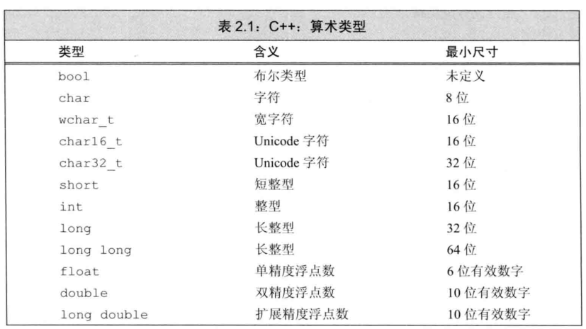

# 第二章 变量和基本类型

任何常用的编程语言都具备一组公共的语法特征，最基本的特征包括：

- 整型、字符型等内置类型
- 变量，用来为对象命名
- 表达式和语句，用于操作上述数据类型的具体值
- if 或 while 等控制结构，有选择地执行一些语句或重复地执行一些语句函数，用于定义可供随时调用的计算单元

大多数编程语言通过两种方式来进一步补充其基本特征：

- 自定义数据类型，实现对语言的扩展
- 将一些有用的功能封装成库函数

## 基本内置类型



>  数据类型long long 是在C++11中新定义的。

## 类型转换

- 非布尔型赋给布尔型，初始值为0则结果为false，否则为true。
- 布尔型赋给非布尔型，初始值为false结果为0，初始值为true结果为1。

当在程序中使用一种类型而其实对象应该取另一种类型时，程序会自动进行类型转换。

```c++
bool b = 42;		// b 为真
int i = b;			// i 的值为3
i = 3.14;			// i 的值为3
double pi = i;		// pi 的值为 3.0
unsigned char c = -1; 	// 假设 char 占8bit， c 的值为255
signed char c2 = 256;	// 假设 char 占8bit, c2 的值是未定义的
```

## 字面值常量

- 一个形如`42`的值被称作**字面值常量**（literal）。

  - 整型和浮点型字面值。

  - 字符和字符串字面值。

    - 使用空格连接，继承自C。

    - 字符字面值：单引号， `'a'`

    - 字符串字面值：双引号， `"Hello World"`

    - 分多行书写字符串。

      ```c++
      std:cout<<"wow, a really, really long string"
                "literal that spans two lines" <<std::endl;
      ```

  - 转义序列。`\n`、`\t`等。

  - 布尔字面值。`true`，`false`。

  - 指针字面值。`nullptr`

> 字符串型实际上时常量字符构成的数组，结尾处以`'\0'`结束，所以字符串类型实际上长度比内容多1。

## 变量

**变量**提供一个**具名**的、可供程序操作的存储空间。   `C++`中**变量**和**对象**一般可以互换使用。

### 变量定义（define）

- **定义形式**：类型说明符（type specifier） + 一个或多个变量名组成的列表。如`int sum = 0, value, units_sold = 0;`
- **初始化**（initialize）：对象在创建时获得了一个特定的值。
  - **初始化不是赋值！**：
  - 初始化 = 创建变量 + 赋予初始值
  - 赋值 = 擦除对象的当前值 + 用新值代替
  - **列表初始化**：使用花括号`{}`，如`int units_sold{0};`
  - 默认初始化：定义时没有指定初始值会被默认初始化；**在函数体内部的内置类型变量将不会被初始化**。
  - 建议初始化每一个内置类型的变量。

### 变量的**声明**（declaration） vs **定义**（define）

  - 为了支持分离式编译，`C++`将声明和定义区分开。**声明**使得名字为程序所知。**定义**负责创建与名字关联的实体。

  - **extern**：只是说明变量定义在其他地方。

  - 只声明而不定义： 在变量名前添加关键字 `extern`，如`extern int i;`。但如果包含了初始值，就变成了定义：`extern double pi = 3.14;`

    ```c++
    extern int i;           // 声明i而非定义i
    int j;                  // 声明并定义j
    extern double pi = 3.14 // 定义
    ```

    

  - 变量只能被定义一次，但是可以多次声明。定义只出现在一个文件中，其他文件使用该变量时需要对其声明。

### 名字的作用域

- 第一次使用变量时再定义它。
- 但是用到全局变量时，尽量不适用重名的局部变量。

## 复合类型

### 引用

> 一般说的引用是指的左值引用 

**引用** 就是为变量（对象）起一个别名

```c++
int val = 1024;
int val1 = 102;
int& refVal = val;		//refVal指向val
refVal = val1;			//refVal引用并没有改变，只是改变了refVal指向的变量val的值，val = val1
int &refVal2;			//错误，引用必须初始化
```

- 引用必须初始化。
- 引用和它的初始值是**绑定bind**在一起的，而**不是拷贝**。一旦定义就不能更改绑定为其他的对象
- `&` 符号可以紧靠基本类型(``int``), 也可以紧靠变量名

**以上说的引用都是左值引用，C++11还有右值引用**

### 指针

**指针** 是 “指向” 另外一种类型的复合类型。指针和引用的不同，指针本身是一个对象，允许对指针赋值和拷贝；指针无须在定义时赋初值。

指针的定义，将声明符写成 `*d` 的形式，其中 `d` 是变量名，如果一条语句种定义类几个指针变量，每个变量前面都必须有符号 `*`

```c++
int *p1, *p2;	// ip1和ip2都是指向int型对象的指针
double dp, *dp2;	//dp2实质性double型对象的指针，dp是double型对象
```

#### 指针值

指针的值应属下列4种状态之一：

- 1.指向一个对象；
- 2.指向紧邻对象的下一个位置；
- 3.空指针, 意味着指针没有指向任何对象
- 4.无效指针, 也就是上述情况之外的其他值

#### 空指针

空指针不指向任何对象，在操作指针之前必须确定为一个非空指针。下列几个生成空指针的方法

```c++
int *p1 = nullptr;		// 等价于 int *p1 = 0;
int *p2 = 0;			// 直接将 p2初始化为字面常量0
// 需要首先 #include <cstdlib>
int *p3 = NULL;			// 等价于 int *p3 = 0;
```

>  ```nullptr```是c++11引入

**建议：初始化所有指针。**

#### 定义多个变量

```
int *p1, p2;   // p1是指向int的指针, *是对p1的修饰, p2是int
```


#### 指向指针的引用

```c
int i = 42;
int *p;			// p是int型的指针
int *&r = p;	// r是一个对指针p的引用
				// &离r最近, 因此r是一个引用, 声明符的其余部分用以确定r引用的类型是什么, int *说明r引用的是一个int指针

r = &i;			// r是一个指针引用，因此给r赋值&i就是令p指向i
*r = 0;			// 解引用r,就是解引用指针p,将p指向的变量i的值改为0
```

> 面对一条比较复杂的指针或引用的声明语句时，从右向左读有助于弄清楚它的真实含义。

## const限定符