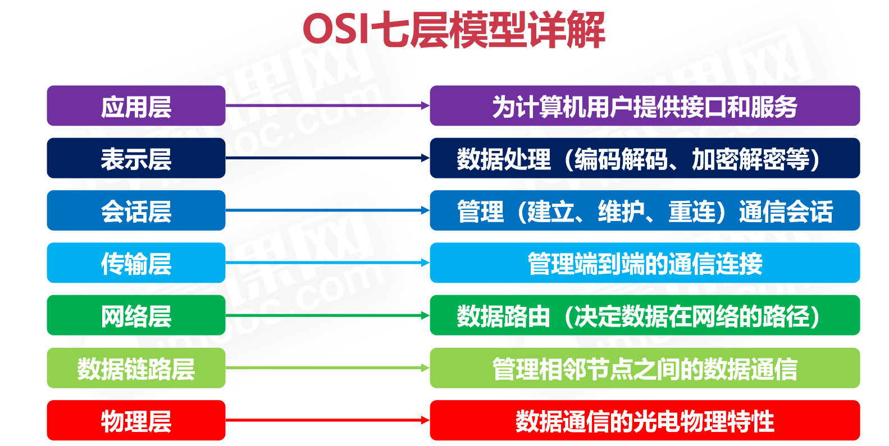
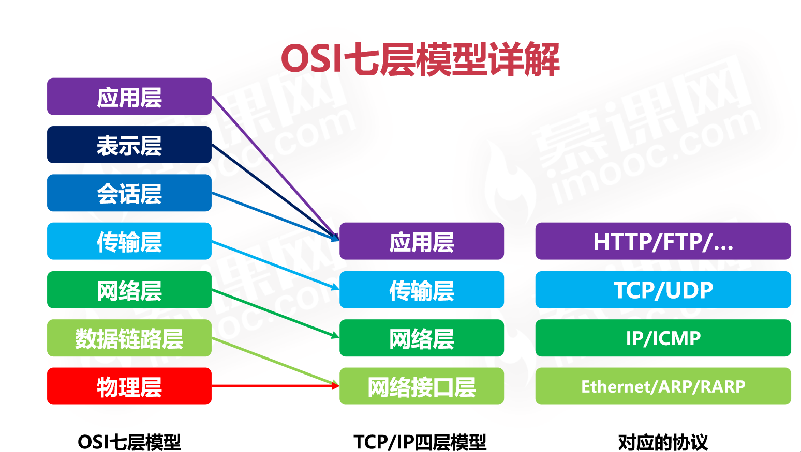
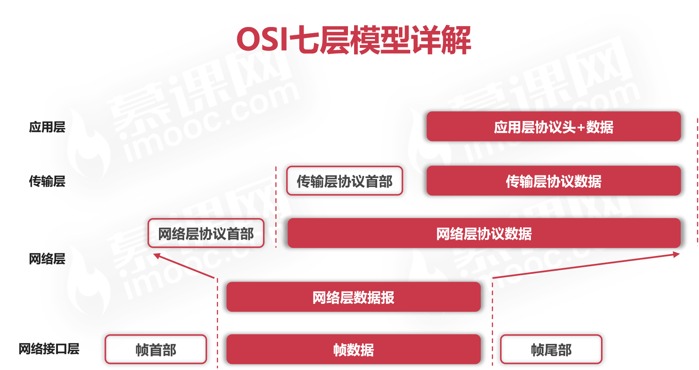

## OSI七层模型是什么？功能是什么？与 TCP/IP 四层模型对应关系？

- 物理层：底层数据传输，如网线；网卡标准。

- 数据链路层：定义数据的基本格式，如何传输，如何标识；如网卡MAC地址。

- 网络层：定义IP编址，定义路由功能；如不同设备的数据转发。

- 传输层：端到端传输数据的基本功能；如 TCP、UDP。

- 会话层：控制应用程序之间会话能力；如不同软件数据分发给不同软件。

- 表示层：数据格式标识，基本压缩加密功能。

- 应用层：各种应用软件，包括 Web 应用。

>  网络七层模型是一个标准，而非实现。  
网络四层模型是一个实现的应用模型。  
网络四层模型由七层模型简化合并而来。

> 网络层提供了主机之间的通信；  
传输层提供了主机不同进程之间的通信；  
应用层提供了不同应用之间的通信。