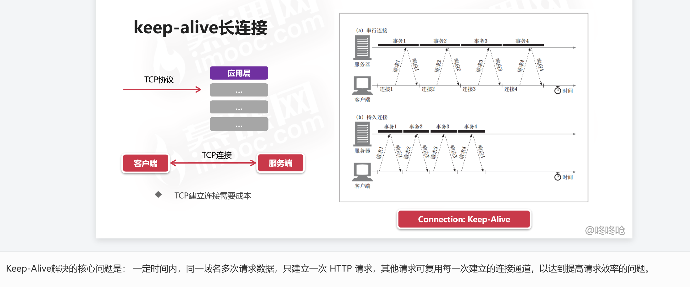

## HHTTP keep-alive长连接

HTTP 的 Keep-Alive 可以使用同一个 TCP 连接来发送和接收多个 HTTP 请求/应答，避免了连接建立和释放的开销，这个方法称为 HTTP 长连接。

HTTP 长连接的特点是，只要任意一端没有明确提出断开连接，则保持 TCP 连接状态。

## 参考链接

[TCP Keepalive 和 HTTP Keep-Alive 是一个东西吗？](https://xiaolincoding.com/network/3_tcp/tcp_http_keepalive.html#http-%E7%9A%84-keep-alive)